# bgatfa-plugins

Plugins I build for [Microbot](https://github.com/chsami/microbot) — the automation-focused
RuneLite fork. Each plugin is written against the Microbot client and ships as a thin,
sideloadable jar.

> **Repo layout:** plugin sources, icons and a self-contained build live under
> [`microbot/`](microbot/). Reference guides for authoring Microbot plugins live under
> [`docs/`](docs/) (see also [`CLAUDE.md`](CLAUDE.md)).

---

## Plugins

### Bank Value Tracker

Tracks your bank's Grand Exchange and high-alch value over time, rendered with the client's
own look-and-feel, real item icons and live prices.

<p align="center">
  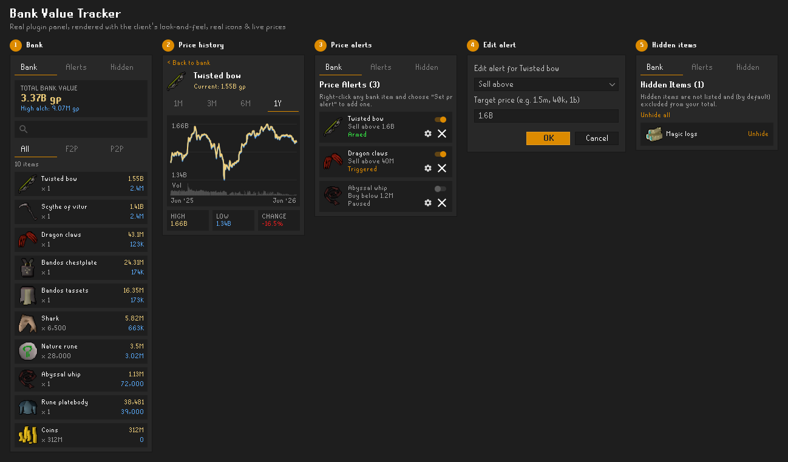
</p>

**Features**

- **Live bank value** — total GE value plus combined high-alch value, updated as your bank changes.
- **Per-item breakdown** — every stack with its GE unit price and quantity, filterable by **All / F2P / P2P** and searchable.
- **Price history** — interactive 1M / 3M / 6M / 1Y charts with high/low/change, sourced from the OSRS Wiki prices API.
- **Price alerts** — set *sell-above* / *buy-below* targets per item; alerts show as **armed**, **triggered** or **paused**, and can repeat.
- **Hidden items** — exclude items from your tracked total with one click.

<table>
  <tr>
    <td align="center" width="20%">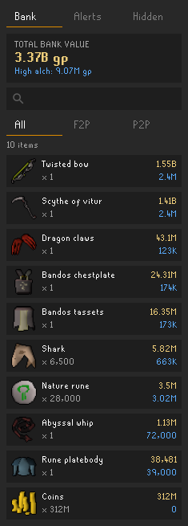<br><sub>Bank total &amp; item list</sub></td>
    <td align="center" width="20%">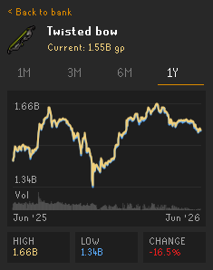<br><sub>Price history</sub></td>
    <td align="center" width="20%">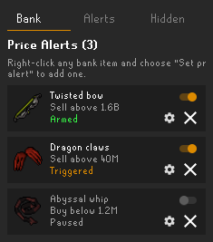<br><sub>Price alerts</sub></td>
    <td align="center" width="20%">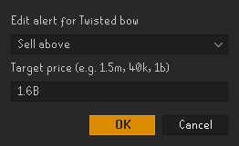<br><sub>Edit an alert</sub></td>
    <td align="center" width="20%">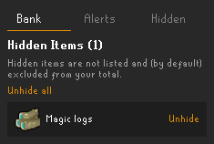<br><sub>Hidden items</sub></td>
  </tr>
</table>

### Loadout Snapshots

Snapshot your current inventory and equipment into named, icon-rendered loadouts you can
review at a glance.

<p align="center">
  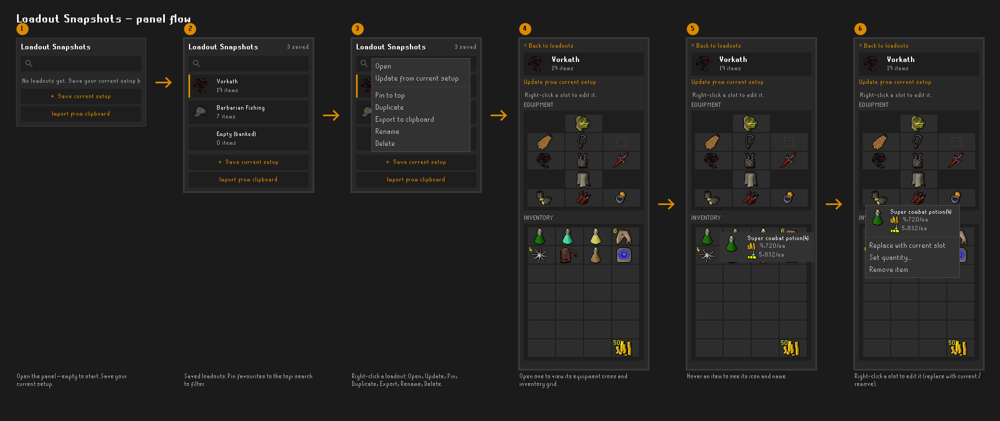
</p>

**Features**

- **Named snapshots** — save the current inventory + equipment as a loadout, with an item count and icon.
- **Icon-rendered view** — the equipment cross and inventory grid drawn with real item icons and stack sizes.
- **Right-click actions** — Open, *Update from current setup*, Pin to top, Duplicate, Export to clipboard, Rename, Delete.
- **Import / export** — move loadouts between characters or share them via the clipboard.
- **Hover details** — tooltips show item name and per-unit GE / high-alch prices.
- **Per-slot edits** — replace a slot with your current one, set a quantity, or remove an item.

<table>
  <tr>
    <td align="center" width="20%">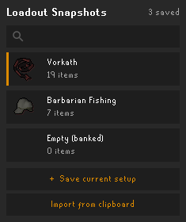<br><sub>Saved loadouts</sub></td>
    <td align="center" width="20%">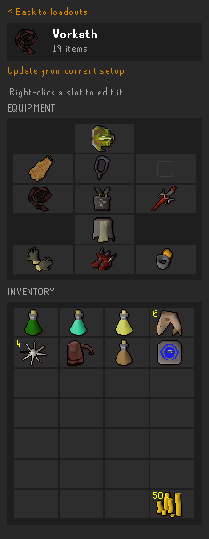<br><sub>Equipment &amp; inventory</sub></td>
    <td align="center" width="20%">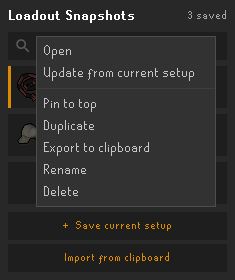<br><sub>Loadout menu</sub></td>
    <td align="center" width="20%">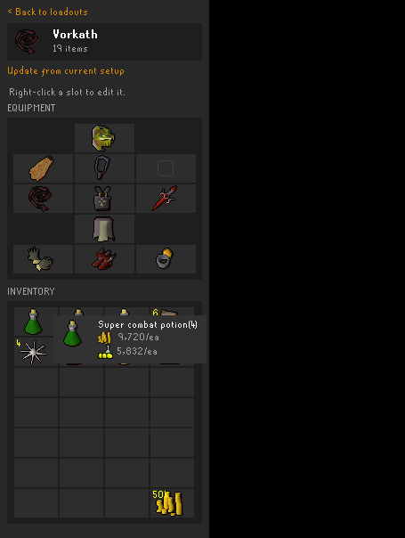<br><sub>Item tooltip</sub></td>
    <td align="center" width="20%">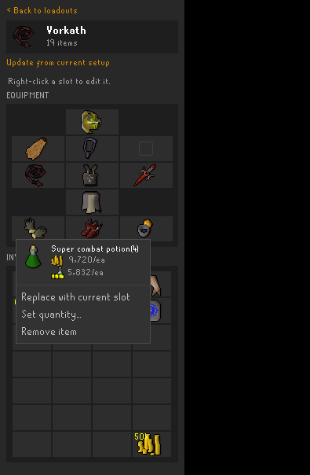<br><sub>Per-slot edit</sub></td>
  </tr>
</table>

---

## Building

The build under [`microbot/`](microbot/) is intentionally lightweight: it doesn't vendor the
client, it compiles each plugin against the published Microbot client — exactly as if it were
being built from inside the Microbot repo — and emits one thin jar per plugin.

```bash
cd microbot
./gradlew assemble
```

Output jars land in `microbot/build/libs/`:

| Plugin | Jar |
| --- | --- |
| Bank Value Tracker | `bank-value-tracker.jar` |
| Loadout Snapshots | `loadout-snapshots.jar` |

The client version to compile against is set by `microbotClientVersion` in
[`microbot/gradle.properties`](microbot/gradle.properties). The client artifact is resolved
from the Microbot Maven repo (`microbotRepoUrl`); to build against a client you've installed
locally instead, run `./gradlew publishToMavenLocal` in your Microbot checkout and then build
with `-PmicrobotRepoUrl=`.

## Installing

Drop the built jars into your Microbot side-loaded plugins folder and restart the client; both
plugins register themselves via their `@PluginDescriptor`.

---

## Documentation

Reference guides for authoring Microbot plugins, mirrored from the Microbot repo:

- [`docs/script-authoring.md`](docs/script-authoring.md) — plugin/script structure and threading rules
- [`docs/state-machines.md`](docs/state-machines.md) — the state-machine framework (for 3+ phase scripts)
- [`docs/ARCHITECTURE.md`](docs/ARCHITECTURE.md) — client/runtime architecture
- [`docs/decisions/`](docs/decisions/) — architecture decision records
- [`docs/development.md`](docs/development.md) · [`docs/installation.md`](docs/installation.md) — setup
